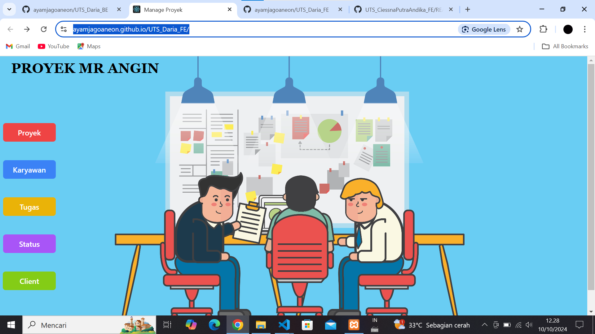
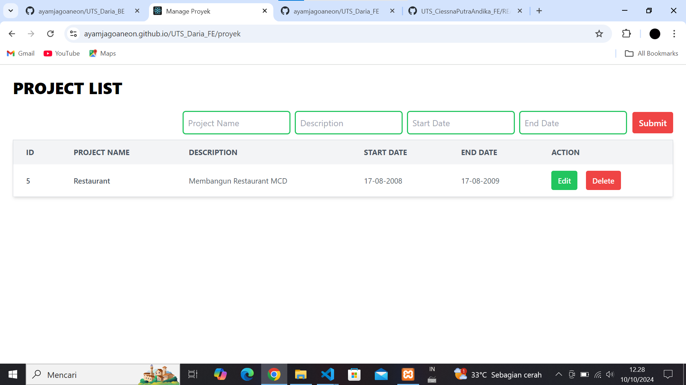
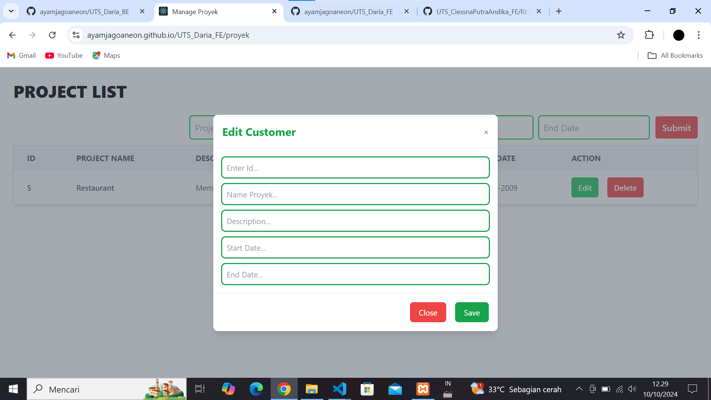

# TUGAS PTS FRONTEND
Disini saya membuat sebuah project UTS Front End yaitu Management Proyek dengan menggunakan library React JS, EXPRESS JS, React Router DOM untuk melakukan routing, AXIOS untuk melakukan fetching data dan menggunakan Tailwind CSS pada tampilan web.

### DIGUNAKAN DALAM PEMBUATAN FRONT END
- <b>React</b> - JavaScript library for building user interfaces.
- <b>Tailwind CSS</b> - A utility-first CSS framework.
- <b>Axios</b> - Promise-based HTTP client for API requests.
- <b>React Router DOM</b> - A library for routing in React applications, providing a way to navigate between different components or pages within a web application.

### ROUTING AKSES MENU
- /proyek

### SCREENSHOTS
Berikut hasil screenshot dari tampilan yang telah dibuat :

1. Halaman awal : https://ayamjagoaneon.github.io/UTS_Daria_FE/ 
2. Halaman Add, Edit, dan Delete : https://ayamjagoaneon.github.io/UTS_Daria_FE/proyek 
3. Modal Edit : https://ayamjagoaneon.github.io/UTS_Daria_FE/proyek 